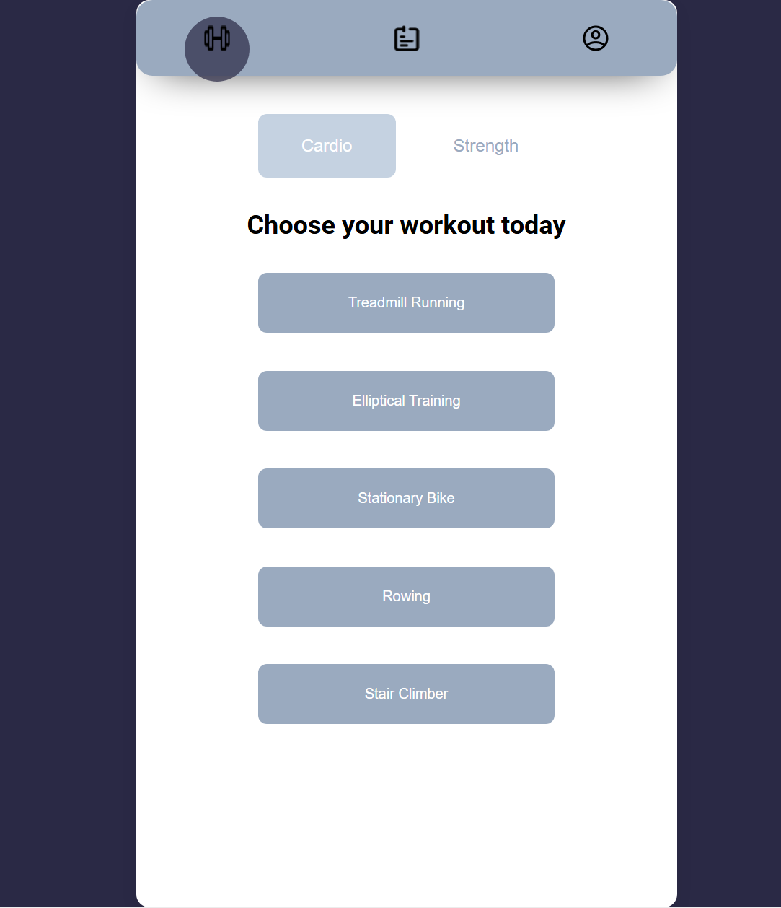
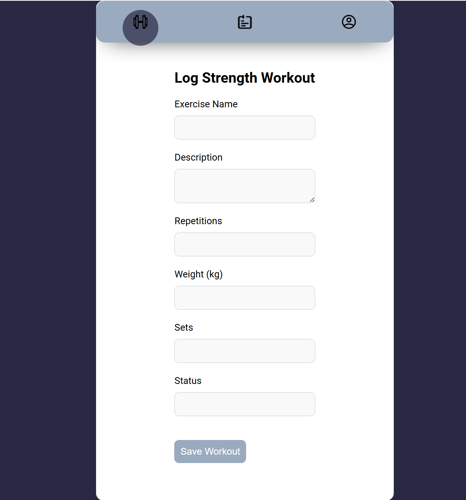
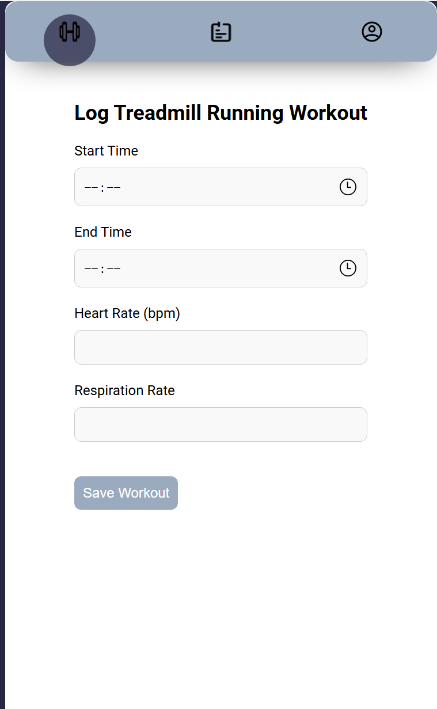
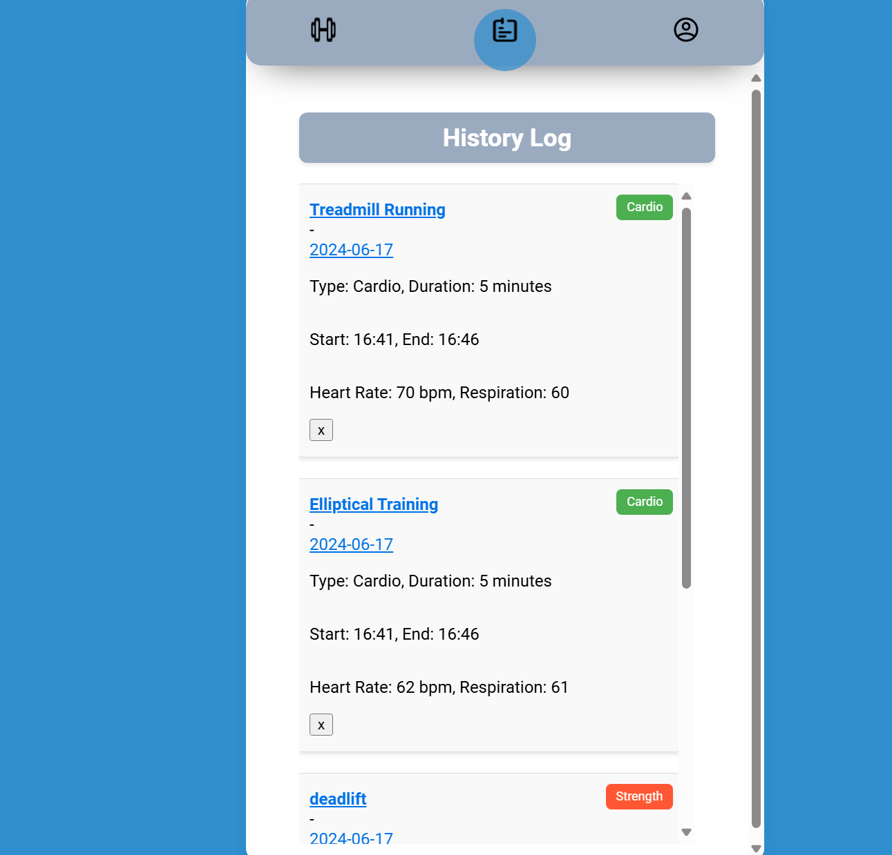
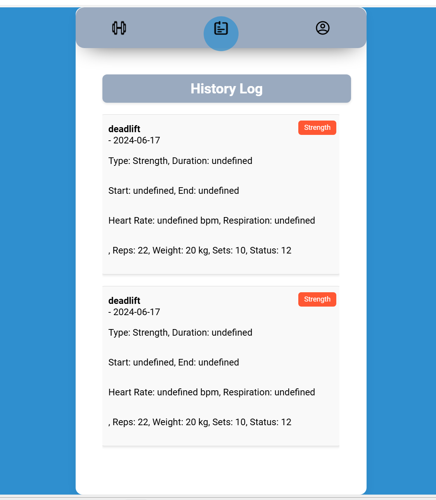
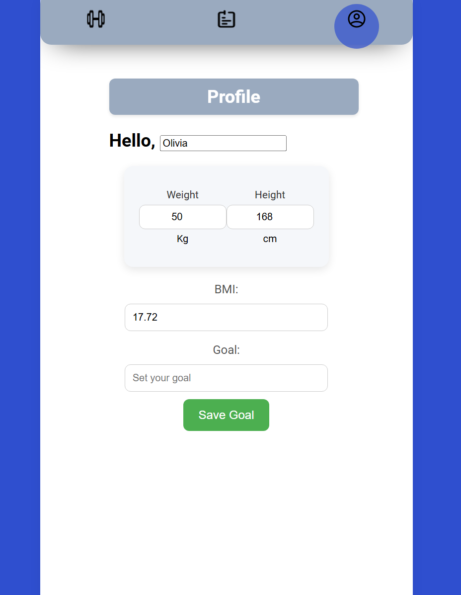

# Workout App

## Overview

The Workout App is designed primarily for mobile devices to provide convenience for users who bring their phones to the gym. The app's simple and intuitive design allows for quick workout logging and profile management, avoiding the complexity that can distract users during their workouts.

## Design Rationale

### Mobile-First Approach

**Convenience**: Users are more likely to have their mobile phones at the gym than a laptop, making it essential for the app to function seamlessly on mobile devices. The layout is optimized for smaller screens, ensuring a smooth and accessible user experience on smartphones.

**Responsive Design**: The interface automatically adjusts to different screen sizes, ensuring a consistent experience whether on a mobile device or tablet.

### Aesthetic Choices

**Font Selection**: The app uses the 'Roboto' font, which is modern, clean, and highly readable on mobile screens. This font choice enhances legibility and gives the app a professional and user-friendly appearance.

**Color Scheme**: The primary color palette includes soft blue shades (#9AAABF and #C5D2E1), which create a calm and focused environment. These colors are chosen for their soothing effect and minimal strain on the eyes, making it easier for users to focus on logging their workouts.

**Simple Navigation**: The app features a straightforward navigation system with large, clearly labeled buttons. This simplicity is intentional to facilitate quick access to different sections without overwhelming the user. The goal is to make the app intuitive and easy to use, even when users are in a busy and distracting environment like a gym.

### Justification for Simple Design

**Ease of Use**: A simple design ensures that users can quickly log their workouts and manage their profiles without unnecessary steps. This design minimizes distractions and makes the app more effective for users who are focused on their fitness routines.

**Performance**: A minimalistic design reduces the load time and improves the app's responsiveness, which is crucial for maintaining user engagement on mobile devices with varying performance levels.

**Accessibility**: By keeping the interface clean and uncluttered, the app remains accessible to a broader range of users, including those who may not be tech-savvy.

## Page Descriptions

### Index Page (`index.html`)

- **Main Application Container (`#app`)**: 
  - The core structure of the app that houses all sections and ensures a cohesive layout.

- **Navigation Bar (`#top-nav`)**:
  - Contains buttons for navigating to different sections: Exercise, Stats, and Profile.

### Sections

- **Exercise Section (`#exerciseSection`)**: 
  - Allows users to choose between Cardio and Strength workouts.
  - Initially shown when the app is loaded.

- **Cardio Detail Section (`#cardioDetailSection`)**:
  - Provides a form to log details such as start time, end time, heart rate, and respiration rate.

- **Strength Detail Section (`#strengthSection`)**:
  - Includes fields to log exercise name, description, repetitions, weight, sets, and status.

- **Stats Section (`#statsSection`)**:
  - Displays the history of logged workouts for review.
  - Users can delete entries by clicking a corresponding delete button.

- **Profile Section (`#profileSection`)**:
  - Lets users input and view their profile information including weight and height.
  - Users can calculate their BMI and set personal fitness goals.

## Page Descriptions

### **Index Page**
The main entry point for the app. It provides access to all other sections:

- **Navigation Bar**: Includes buttons for navigating to the Exercise, Stats, and Profile sections.
- **Exercise Section**: The default view, showing options for Cardio and Strength workouts.

### **Exercise Section**
This section allows users to choose between Cardio and Strength workouts:

- **Cardio Options**: Presents a list of cardio workouts (e.g., Treadmill Running, Elliptical Training). Clicking an option leads to a form where users can log workout details such as start time, end time, heart rate, and respiration rate.

- **Strength Options**: Displays a form for logging strength workouts, including fields for exercise name, description, repetitions, weight, sets, and status.

### **Cardio Detail Section**
This section contains a form for users to log details of their cardio workouts, including start and end times, heart rate, and respiration rate.

### **Stats Section**
This section provides a history of logged workouts. Users can review past cardio and strength workouts and have the option to delete any entry by clicking the 'x' button next to it.

users can also retrieve history log by category

### **Profile Section**
Allows users to input and view their profile information, including name, weight, and height. The section also provides tools to calculate BMI and set fitness goals.

## Version Control with GitHub
git remote add origin https://github.com/OLIBIALEE/gymapp.git
git push -u origin main
git add .
git push

Reference:
AI(chatGPT) has been used to debugging and adjusting the backend and frontend code, as well as formating the readme file.
